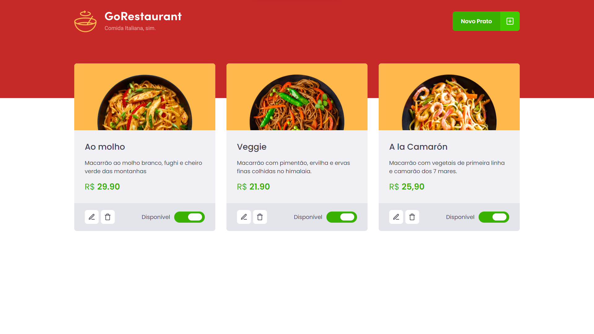

# GoRestaurant



O GoRestaurant é um app de gerenciamento de restaurante desenvolvido dentro do curso Ignite da Rocketseat com o intuito de treinar a migração de Javascript para Typescript e de Class Components para Function Components.

## :wrench: Tecnologias

- [ReactJS](https://reactjs.org/)
- [Typescript](https://www.typescriptlang.org/)
- [styled-components](https://styled-components.com/)

## :computer: Instalação

### Requerimento
- Você precisa ter instalado o [Node.js](https://nodejs.org/en/download/) e [Yarn](https://yarnpkg.com/) para execultar esse projeto.

```bash
# Clone este repositório
$ git clone https://github.com/JoseVictorNascimento/complementaryChallenge02-trilha-react-ignite.git

# Entre na pasta
$ cd complementaryChallenge02-trilha-react-ignite

# Instale as dependências
$ yarn ou yarn install

# Execute a aplicação em modo de desenvolvimento
$ yarn dev

# Execute a Fake API
$ yarn server

# O servidor inciará na porta:3000
acesse <http://localhost:3000>
```

## 📝 License

Este projeto está licenciado sob a Licença MIT - consulte o arquivo [LICENSE](LICENSE) para mais detalhes.

---

Feito com 💜 por Victor Nascimento
